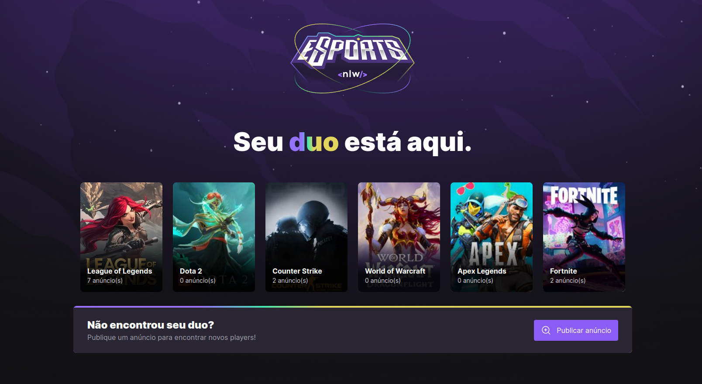
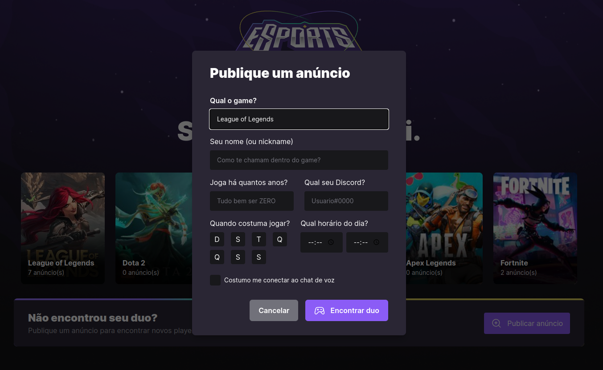
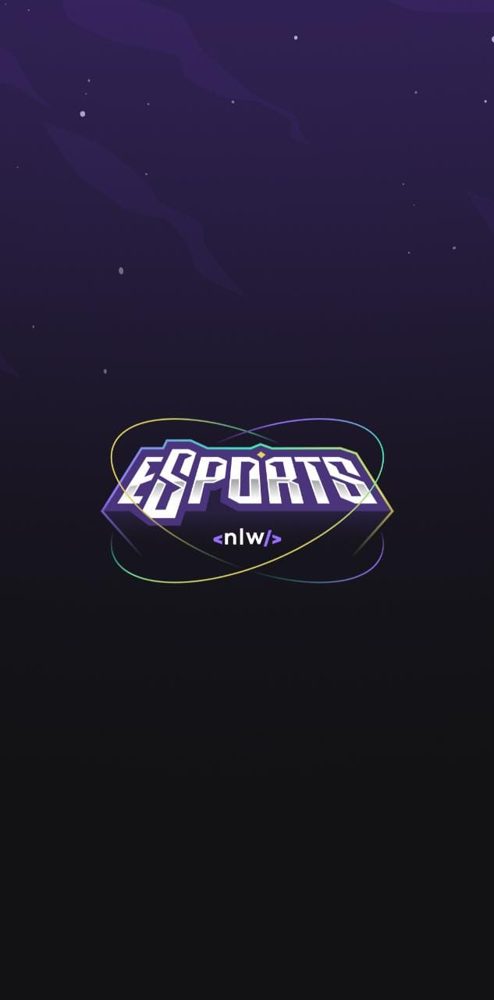
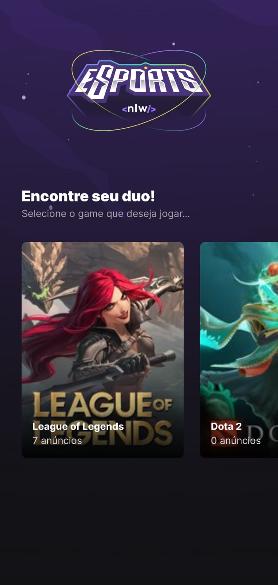
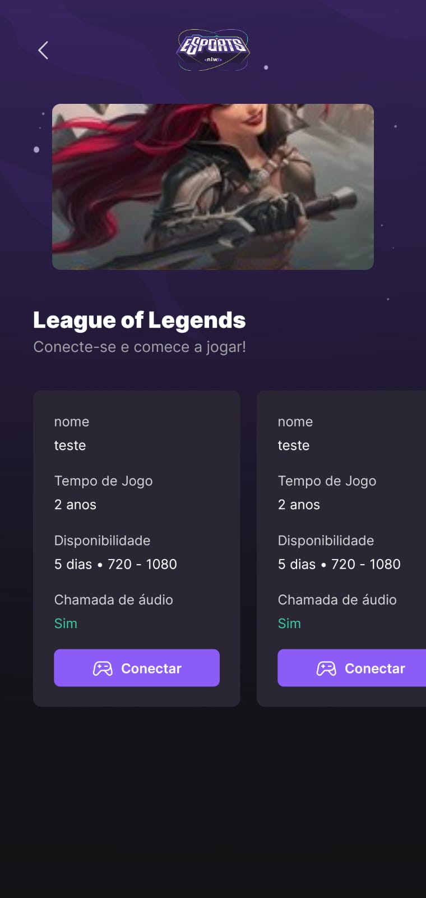

<h1 align="center">
NLW eSPORTS🚀
</h1>
<p align="center">
<a target="_blank" rel="noopener noreferrer" href="https://camo.githubusercontent.com/66fe19848b26f90cf13a99b798f742a9e7809b27/68747470733a2f2f696d672e736869656c64732e696f2f62616467652f746563682d66726f6e742d2d656e642d627269676874677265656e"></a>

<p align="center">
</p>

<br>
<hr>
<br>

- [Description](#description)
- [Stack and tools](#stack-and-tools)
- [Quickstart](#quickstart)

<br>

## Description

The project is called _Find your Duo_.
It is a platform to find the perfect partner to play your favorite game together, by connecting your Twitch.tv account.

<p align="center">
</p>
<p align="center">
</p>
<div style="display: flex; justify-content: space-evenly;">



</div>

## Stack and tools

- [Node.js](https://nodejs.org/en/)
- [Prisma](https://www.prisma.io/)
- [React](https://reactjs.org/)
- [React Native](https://reactnative.dev/)
- [Expo](https://expo.dev/)
- [Figma](https://www.figma.com/)
- [Radix UI](https://www.radix-ui.com/)

## Quickstart

### Server

First, create a new `.env` file on the root directory, using the `.env.example` template as base.

Then, to create the local db run:

```sh
$ npm install
$ npm run db:migrate
```

After that, to start the server, run:

```sh
$ npm run dev
```

### Web

To run the local Vite web client:

```sh
$ npm install
$ npm run dev
```

### Mobile

To run the local expo client:

```sh
$ npm install
$ npm run start
```
